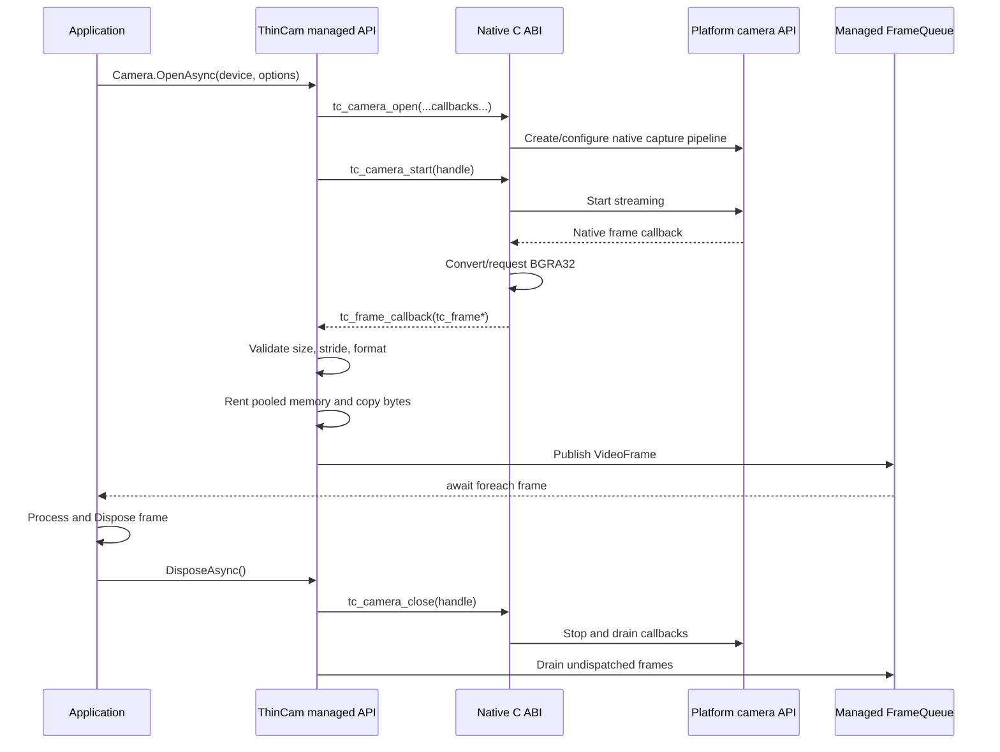

# ThinCam architecture and implementation guide

This document explains the design of ThinCam from the public C# API down to each operating system's native camera stack. It is intended for maintainers, contributors, reviewers, and application developers who need to understand how frames move through the library and where platform behavior differs.

For exact build commands, toolchain prerequisites, native artifact staging, managed project builds, and NuGet packaging, see [Building.md](Building.md). For public API usage, see [API.md](API.md), and for the capability-driven Exposure, Focus, Zoom, and Light surface, see [Controls.md](Controls.md). Optional presentation layers are documented in [SkiaSharp.md](SkiaSharp.md) and [Avalonia.md](Avalonia.md). The binary interface shared by C# and the native libraries is summarized in [ABI.md](ABI.md).

## Contents

- [Project goal](#1-project-goal)
- [Design principles](#2-design-principles)
- [Repository layout](#3-repository-layout)
- [End-to-end data path](#4-end-to-end-data-path)
- [Managed project structure](#5-managed-project-structure)
- [Native C ABI](#6-native-c-abi)
- [Shared native utilities](#7-shared-native-utilities)
- [Windows backend](#8-windows-backend)
- [Linux backend](#9-linux-backend)
- [Apple backend](#10-apple-backend-macos-and-ios)
- [Android backend](#11-android-backend)
- [Permissions by platform](#12-permissions-by-platform)
- [Device identifiers and defaults](#13-device-identifiers-and-defaults)
- [Pixel layout and transforms](#14-pixel-layout-stride-rotation-and-mirroring)
- [Threading model](#15-threading-model)
- [Packaging model](#16-packaging-model)
- [Build architecture](#17-build-architecture)
- [CI design](#18-ci-design)
- [Version 2 constraints](#19-version-2-constraints)
- [Extension strategy](#20-extension-strategy)
- [Testing strategy](#21-testing-strategy)
- [Security and robustness](#22-security-and-robustness-considerations)
- [Optional presentation layers and demo](#23-optional-presentation-layers-and-demo)
- [Summary](#24-summary)

## 1. Project goal

ThinCam provides a small, frame-oriented camera capture API for .NET without embedding a general-purpose computer-vision or media framework.

The project deliberately uses the camera framework already provided by each operating system:

| Platform | Native capture API | ThinCam implementation                                |
| -------- | ------------------ | ----------------------------------------------------- |
| Windows  | Media Foundation   | Asynchronous `IMFSourceReader`                        |
| Linux    | Video4Linux2       | Streaming I/O with `mmap` buffers                     |
| macOS    | AVFoundation       | `AVCaptureSession` and `AVCaptureVideoDataOutput`     |
| iOS      | AVFoundation       | `AVCaptureSession` and `AVCaptureVideoDataOutput`     |
| Android  | Camera2 NDK        | `ACameraManager`, capture session, and `AImageReader` |

The common public behavior is intentionally narrow:

1. Check or request camera permission.
2. Enumerate camera devices.
3. Open one camera with preferred dimensions and frame rate.
4. Receive BGRA32 frames through an asynchronous stream.
5. Dispose each frame when processing is complete.
6. Dispose the camera to synchronously stop native capture and drain callbacks.

ThinCam does **not** try to be a recording, encoding, playback, computer-vision, or UI-preview framework. Keeping those concerns out of the core is what allows the native libraries to remain small.

## 2. Design principles

### 2.1 One public API, platform-native implementations

Application code should not need to know whether the current platform uses Media Foundation, V4L2, AVFoundation, or Camera2. The managed layer exposes one set of types and calls a stable C ABI implemented separately on each platform.

The abstraction is uniform where uniform behavior is useful, but it does not erase meaningful platform differences. Permissions, device identifiers, default-camera selection, rotation metadata, frame-stride behavior, and format negotiation still follow the capabilities of the host platform.

### 2.2 Small native dependency surface

ThinCam links only to operating-system frameworks and standard native runtime libraries:

- Windows: Media Foundation and COM libraries.
- Linux: the kernel V4L2 API and pthreads.
- Apple: AVFoundation, CoreMedia, CoreVideo, and Foundation.
- Android: Camera2 NDK, Media NDK, Android native APIs, and logging.

There is no OpenCV, FFmpeg, GStreamer, VLC, MAUI, or AndroidX dependency in the capture core.

### 2.3 Stable C ABI between managed and native code

The native implementations are C++ or Objective-C++, but they expose a plain C interface declared in `Native/include/thincam.h`. The managed library accesses that interface with source-generated P/Invoke.

A C ABI was chosen because it is:

- Straightforward to call from .NET.
- Stable across C++ compiler implementations.
- Easy to version and inspect.
- Usable from dynamically linked desktop libraries and a statically linked iOS library.
- Small enough to audit completely.

### 2.4 Predictable output format

Version 2 always presents frames as top-to-bottom BGRA32.

Each pixel occupies four bytes:

```text
byte 0: blue
byte 1: green
byte 2: red
byte 3: alpha, normalized to 255
```

This is not necessarily the camera's native format. The backends convert or request a compatible format before invoking managed code:

- Windows asks Media Foundation for RGB32 and normalizes the fourth byte to opaque alpha.
- Linux converts YUYV or UYVY to BGRA32.
- Apple requests `kCVPixelFormatType_32BGRA`.
- Android converts `YUV_420_888` planes to BGRA32.

The uniform output simplifies consumers and keeps format conversion out of application code. It does cost CPU on platforms where the device produces YUV, and it creates one native conversion buffer plus one managed copy per delivered frame.

### 2.5 Explicit ownership and bounded latency

Native camera buffers are generally owned by the operating system and valid only during a callback. ThinCam copies each callback buffer immediately into pooled managed memory.

The managed queue is bounded. When the application cannot consume frames as quickly as the camera produces them, ThinCam disposes the oldest queued frame and keeps newer frames. This favors low latency over processing every historical frame.

## 3. Repository layout

```text
ThinCam/
├── Sources/ThinCam/                    Managed capture API, interop, runtime assets
│   └── runtimes/<rid>/native/      Staged native libraries
├── Sources/ThinCam.SkiaSharp/          Optional frame conversion and reusable buffers
├── Sources/ThinCam.Avalonia/           Optional reusable Avalonia preview source/control
├── Native/include/                 Public versioned C ABI header
├── Native/common/                  Shared status and pixel conversion code
├── Native/windows/                 Media Foundation backend
├── Native/linux/                   V4L2 backend and native conversion tests
├── Native/apple/                   Shared macOS/iOS AVFoundation backend
├── Native/android/                 Camera2 NDK backend
├── Samples/ThinCamDemo.Console/        Desktop console sample
├── Samples/ThinCamDemo/           Shared Avalonia views, view model, and services
├── Samples/ThinCamDemo.Desktop/   Windows/Linux/macOS application head
├── Samples/ThinCamDemo.Android/   Android application and permission host
├── Samples/ThinCamDemo.iOS/       iOS application head and camera purpose string
├── Tests/ThinCamTests.SkiaSharp/  Conversion, transform, encoding, and buffer tests
├── Tests/ThinCamTests.Avalonia/   Preview-source ownership and transform tests
├── Build/                          Native build, demo, staging, and pack scripts
├── Docs/                           Technical documentation
├── .github/workflows/build.yml     Cross-platform CI: native builds, tests, and packaging
├── Directory.Build.props           Shared build quality settings and MinVer versioning
├── Directory.Packages.props        Central package version management
├── NuGet.config                    Single NuGet source for hermetic restore
└── ThinCam.slnx                    Managed libraries, tests, and samples
```

## 4. End-to-end data path

The following sequence shows the normal path of one frame:



The central safety property is that the native buffer is never retained by managed code. Its contents are copied before the unmanaged callback returns.

## 5. Managed project structure

The public managed library is `Sources/ThinCam/ThinCam.csproj`.

It targets:

```xml
<TargetFrameworks>net10.0;net10.0-android;net10.0-ios</TargetFrameworks>
```

Desktop consumers use the `net10.0` assembly on Windows, Linux, and macOS. Mobile consumers use the platform target frameworks so the package can include platform-specific permission code and native asset wiring.

The project enables:

- Nullable reference types.
- Unsafe code for unmanaged callback function pointers.
- Source-generated P/Invoke through `LibraryImport`.
- Trimming compatibility.
- Native AOT compatibility declarations.
- XML API documentation generation.
- Warnings as errors through `Directory.Build.props`.

### 5.1 Public managed types

The main public surface is:

| Type                | Purpose                                                                   |
| ------------------- | ------------------------------------------------------------------------- |
| `CameraPermissions` | Inspect and request camera permission                                     |
| `CameraDevices`     | Enumerate devices and find the backend-selected default                   |
| `CameraDevice`      | Opaque device identifier, display name, position, and default flag        |
| `CameraOpenOptions` | Preferred width, height, frame rate, pixel format, and queue capacity     |
| `Camera`            | Owns an open and running native camera                                    |
| `VideoFrame`        | Owns one pooled managed frame buffer                                      |
| `CameraFormat`      | Actual dimensions, stride, and pixel format observed from the first frame |
| `CameraException`   | Stable cross-platform error with a `CameraErrorCode`                      |

The library does not expose backend-specific handles or native types.

### 5.2 Camera lifecycle

`Camera.OpenAsync` performs both native open and start. There is no separate public `StartAsync`.

The sequence inside `Camera.OpenAsync` is:

1. Validate the device and options.
2. Verify that the loaded native library exposes the expected ABI version.
3. Require `CameraPermissionStatus.Granted`.
4. Allocate a managed `CameraState`.
5. Pin that state indirectly with a `GCHandle` so native callbacks can identify it.
6. Call `tc_camera_open` with unmanaged function pointers for frame and error callbacks.
7. Wrap the returned pointer in `SafeCameraHandle`.
8. Call `tc_camera_start`.
9. Return a `Camera` only after the native backend reports successful startup.

Native open/start calls can block while the platform configures a device. They therefore execute through `Task.Run` rather than on a UI synchronization context.

Cancellation currently prevents entry into startup only if the token is already cancelled. Once native startup has begun, the operation is not interrupted by the token. This avoids abandoning a native handle during platform initialization, but it should be considered when designing UI timeouts.

### 5.3 Safe native ownership

`SafeCameraHandle` derives from `SafeHandleZeroOrMinusOneIsInvalid`. Releasing the handle calls `tc_camera_close`.

The managed code depends on the native contract that close is synchronous with respect to callbacks: after close returns, no frame or error callback can access the managed `GCHandle`. Only then does `Camera.DisposeAsync` free the `GCHandle`.

This order is critical:

```text
mark managed state closed
        ↓
close native camera and drain callbacks
        ↓
dispose queued frames
        ↓
free GCHandle used by callbacks
```

Freeing the `GCHandle` before native callbacks are drained would create a use-after-free risk.

### 5.4 Unmanaged callbacks

The managed callback entry points use `UnmanagedCallersOnly` with the C calling convention. Function pointers are passed directly to `tc_camera_open`; no delegate object or reverse-P/Invoke thunk needs to be retained.

Every unmanaged callback catches all exceptions. A managed exception must never unwind across native code.

The frame callback validates:

- The frame pointer and data pointer are non-null.
- The native structure is at least the expected size.
- The length fits in a managed `int`.
- Width, height, and stride are positive.
- The pixel format is BGRA32.
- The byte length is consistent with dimensions and stride.
- The managed camera state is still open.

Only after validation does it rent memory and copy the frame.

### 5.5 Frame memory ownership

`VideoFrame` wraps an `IMemoryOwner<byte>` rented from `MemoryPool<byte>.Shared`.

`VideoFrame.Data` returns only the valid `DataLength` portion of the rented block. A pool may return a larger block than requested, so consumers must use `Data` rather than assuming the underlying owner length equals the frame length.

A frame must be disposed:

```csharp
await foreach (VideoFrame frame in camera.GetFramesAsync(token))
{
    using (frame)
    {
        Process(frame.Data.Span, frame.Width, frame.Height, frame.Stride);
    }
}
```

After disposal, accessing `Data` throws `ObjectDisposedException`. Disposing more than once is safe.

Consumers must not store `frame.Data` beyond the lifetime of the `VideoFrame`. Copy the data into application-owned storage if it must outlive the frame.

### 5.6 Frame queue and backpressure

`FrameQueue` uses a bounded `Channel<VideoFrame>` and an explicit lock.

Although the channel is configured with `BoundedChannelFullMode.Wait`, producers never asynchronously wait. `Publish` attempts an immediate write. If the queue is full, it removes and disposes the oldest queued frame, then retries.

This produces latest-frame behavior:

```text
queue capacity 2

existing: [frame 100, frame 101]
new: frame 102

frame 100 is disposed
result: [frame 101, frame 102]
```

The queue capacity is configurable from 1 to 32. A capacity of 1 minimizes latency and maximizes frame dropping. A larger capacity tolerates short processing bursts but retains more memory and increases potential latency.

Only one call to `GetFramesAsync` is allowed per `Camera`. The one-reader rule matches the queue's single-reader configuration and avoids ambiguous frame ownership. Applications that need multiple consumers should create their own fan-out after reading from ThinCam.

### 5.7 Active format

`Camera.ActiveFormat` is initially `null`. It is populated from the first valid frame because several platforms may select dimensions different from the requested values.

Version 2 records:

- Actual width.
- Actual height.
- Actual stride.
- Actual pixel format.

The actual frame rate is not currently exposed because the backends do not all report a reliable negotiated rate through the common ABI.

### 5.8 Errors

Native status values map numerically to `CameraErrorCode`.

| Error code           | Meaning                                           |
| -------------------- | ------------------------------------------------- |
| `InvalidArgument`    | Invalid API or ABI input                          |
| `NotSupported`       | Device or backend capability is unsupported       |
| `PermissionDenied`   | OS or device permission prevents access           |
| `DeviceNotFound`     | Device is missing or disconnected                 |
| `DeviceBusy`         | Another process or camera session owns the device |
| `FormatNotSupported` | Requested/required format cannot be configured    |
| `NotRunning`         | Operation requires an active stream               |
| `AlreadyRunning`     | Duplicate start attempt                           |
| `Platform`           | Unclassified native platform failure              |
| `Timeout`            | Platform startup or state transition timed out    |
| `Cancelled`          | Native operation was cancelled                    |

Startup failures are thrown from `Camera.OpenAsync`. Runtime failures are published to the frame stream as a terminal exception and stored in `Camera.LastError`. A fatal native error completes the queue, causing the `await foreach` loop to fail with `CameraException`.

## 6. Native C ABI

The shared interface is declared in `Native/include/thincam.h`.

### 6.1 Exported functions

Every backend exposes the same twelve symbols:

```c
uint32_t tc_get_abi_version(void);
const char* tc_status_message(tc_status status);

tc_status tc_get_permission_status(tc_permission_status* status);
tc_status tc_request_permission(tc_permission_callback callback, void* user_data);
tc_status tc_enumerate_devices(tc_device_callback callback, void* user_data);

tc_status tc_camera_open(..., tc_camera** camera);
tc_status tc_camera_start(tc_camera* camera);
tc_status tc_camera_stop(tc_camera* camera);
void tc_camera_close(tc_camera* camera);
```

`tc_get_abi_version` and `tc_status_message` are implemented in `Native/common/thincam_common.cpp`. Permission, enumeration, and capture operations are implemented by each platform backend.

### 6.2 ABI versioning

`TC_ABI_VERSION` is currently `1`.

The managed layer calls `tc_get_abi_version` before permission, enumeration, or capture operations. A mismatch results in `CameraErrorCode.NotSupported` before structures or callbacks are exchanged.

Increment the ABI version when making a binary-incompatible change such as:

- Reordering existing fields.
- Changing field types or calling conventions.
- Removing an exported function.
- Changing callback lifetime guarantees.
- Changing the meaning of existing enum values.

Adding fields at the end of a structure can remain compatible when both sides honor `struct_size`, but the implications should still be reviewed carefully.

### 6.3 Structure-size fields

Every exchanged structure begins with `struct_size`. The managed callback checks that incoming structures are at least as large as the version it understands.

The native helper `normalized_options` accepts defaults and only reads the currently defined fields. A future ABI can use `struct_size` to avoid reading fields not supplied by an older caller.

### 6.4 String and callback lifetimes

All ABI strings are null-terminated UTF-8.

Device enumeration is synchronous. Device ID and name pointers are valid only during the device callback. The managed callback immediately copies both strings.

Frame data is valid only during the frame callback. The managed callback immediately copies it into pooled memory.

Error-message strings are valid only during the error callback. Managed code converts them to `string` immediately.

### 6.5 Native stop guarantee

`tc_camera_stop` is defined to be synchronous and to guarantee that callbacks have drained before it returns. `tc_camera_close` invokes stop before releasing the platform objects.

Each backend implements that guarantee differently:

- Windows flushes the asynchronous Source Reader and waits for `OnFlush`.
- Linux joins the capture thread.
- Apple detaches the delegate, stops the session, and drains the serial dispatch queue.
- Android detaches the image listener, closes the session, and waits for in-flight image callbacks.

### 6.6 Native library resolution

For Windows, Linux, macOS, and Android, the managed declaration uses:

```csharp
private const string LibraryName = "thincam";
```

The runtime maps that logical name to:

- `thincam.dll` on Windows.
- `libthincam.so` on Linux and Android.
- `libthincam.dylib` on macOS.

On iOS, the native library is statically linked into the application. The managed declaration uses `__Internal`, allowing P/Invoke to resolve exported symbols from the final process image.

## 7. Shared native utilities

`Native/common/thincam_common.hpp` contains header-only helpers shared by multiple backends.

### 7.1 Timestamp fallback

`monotonic_microseconds` uses C++ `steady_clock` for a monotonic fallback timestamp.

Frame timestamps are meaningful for ordering and elapsed-time calculations within a capture session. They are not guaranteed to share an epoch across platforms, processes, or multiple cameras.

### 7.2 YUV conversion

The common layer provides:

- `yuyv_to_bgra` for packed YUYV and UYVY input.
- `yuv420_888_to_bgra` for Android's three-plane YUV buffers.
- `yuv_to_bgra` for one pixel pair's color conversion.

The conversion uses integer BT.601-style coefficients and clamps each channel to the byte range. Alpha is set to 255.

These functions are scalar and intentionally simple. SIMD acceleration can be added later without changing the public API or ABI.

### 7.3 Option normalization

`normalized_options` supplies native defaults of 640 × 480 at 30 FPS and BGRA32 if a caller leaves fields unset. Managed code currently validates and supplies all values, but native defaults protect the ABI when used independently.

## 8. Windows backend

Source: `Native/windows/thincam_windows.cpp`

### 8.1 Native dependencies

The backend links:

```text
mfplat
mfreadwrite
mfuuid
ole32
```

It uses C++17, Windows Runtime Library `ComPtr`, COM, and Media Foundation.

### 8.2 Device enumeration

The backend creates Media Foundation attributes specifying `MF_DEVSOURCE_ATTRIBUTE_SOURCE_TYPE_VIDCAP_GUID`, then calls `MFEnumDeviceSources`.

Each device exposes:

- Friendly name from `MF_DEVSOURCE_ATTRIBUTE_FRIENDLY_NAME`.
- Stable platform identifier from `MF_DEVSOURCE_ATTRIBUTE_SOURCE_TYPE_VIDCAP_SYMBOLIC_LINK`.

ThinCam uses the symbolic link as `CameraDevice.Id`. Device position is reported as `External` because the Media Foundation enumeration path used here does not classify front/back laptop cameras. The first enumerated device is marked as default.

### 8.3 Open and startup model

`tc_camera_open` stores configuration and callbacks but does not activate the camera. `tc_camera_start` creates a worker thread and waits up to ten seconds for definitive startup success or failure.

The worker:

1. Initializes COM for the thread.
2. Ensures Media Foundation is started through a process-wide runtime object.
3. Locates the `IMFActivate` object matching the stored symbolic link.
4. Activates an `IMFMediaSource`.
5. Creates an asynchronous `IMFSourceReader` with an `IMFSourceReaderCallback`.
6. Enables hardware transforms and video processing.
7. Selects RGB32 output.
8. Requests the preferred size and frame rate, then retries with subtype-only negotiation if the exact request fails.
9. Starts the first asynchronous `ReadSample` request.
10. Signals startup success to `tc_camera_start`.

The public `Camera.OpenAsync` does not return until this startup sequence succeeds.

### 8.4 Asynchronous frame loop

The Source Reader invokes `OnReadSample`. The callback:

- Handles device and media errors.
- Detects end-of-stream and format changes.
- Converts the sample to a contiguous media buffer.
- Copies each row into a backend-owned top-to-bottom BGRA buffer.
- Sets alpha to 255 because Media Foundation RGB32 often treats the fourth byte as unused.
- Converts 100-nanosecond Media Foundation timestamps to microseconds.
- Calls the common ThinCam frame callback.
- Requests the next sample.

The copy code handles both `IMF2DBuffer` pitch and ordinary `IMFMediaBuffer` stride, including negative strides used by bottom-up video buffers.

### 8.5 Shutdown

`tc_camera_stop` sets a stop flag and joins the worker thread.

Before the worker exits, it calls `IMFSourceReader::Flush` and waits for `IMFSourceReaderCallback::OnFlush`. The callback's reader pointer is then cleared and the media source is shut down.

This avoids the major failure mode of a synchronous `ReadSample` loop: a stalled camera cannot leave shutdown blocked indefinitely inside a pending read.

### 8.6 Permissions

The Windows backend reports permission status as granted because desktop camera privacy access is not represented by a ThinCam-driven permission prompt. Media Foundation activation can still fail with access denied, which ThinCam maps to `PermissionDenied`.

Applications should guide users to Windows camera privacy settings when activation is denied.

## 9. Linux backend

Source: `Native/linux/thincam_linux.cpp`

### 9.1 Native dependencies

The backend uses:

- Linux V4L2 headers.
- POSIX file, memory mapping, polling, and thread APIs.
- C++17 and pthreads.

There is no dependency on libv4l conversion or FFmpeg.

### 9.2 Permission status

The backend scans `/dev/video0` through `/dev/video63`.

If a node can be opened read/write, ThinCam reports permission granted. If video nodes exist but access fails with `EACCES` or `EPERM`, it reports denied. If no nodes exist, permission is considered granted because the absence of hardware is not itself a permissions failure.

`tc_request_permission` cannot display a system prompt on Linux; it simply returns the same status. Device access must be fixed through groups, ACLs, container device mappings, or udev rules.

### 9.3 Device enumeration

For each `/dev/videoN` node, ThinCam calls `VIDIOC_QUERYCAP` and keeps devices that support both:

- `V4L2_CAP_VIDEO_CAPTURE`.
- `V4L2_CAP_STREAMING`.

The device path is the ID, the V4L2 card name is the display name, and the first compatible device is marked default. Position is `External` because generic V4L2 metadata does not reliably identify front/back orientation.

### 9.4 Open and configuration

The device is opened with:

```text
O_RDWR | O_NONBLOCK | O_CLOEXEC
```

The backend verifies capture and streaming capability, then tries packed formats in this order:

1. `V4L2_PIX_FMT_YUYV`
2. `V4L2_PIX_FMT_UYVY`

Requested width is rounded down to an even value because packed 4:2:2 conversion operates on pairs of pixels. The driver may adjust dimensions. The resulting stride is at least `width * 2`.

Frame-rate selection is attempted through `VIDIOC_S_PARM`. Failure is ignored because many drivers do not implement frame-rate configuration even though capture works.

The backend requests four `V4L2_MEMORY_MMAP` buffers, queries each buffer, and maps it into the process.

### 9.5 Streaming loop

Startup queues every mapped buffer and issues `VIDIOC_STREAMON`. A dedicated worker thread then:

1. Polls the file descriptor with a 250 ms timeout.
2. Detects disconnect and device errors.
3. Dequeues a filled buffer with `VIDIOC_DQBUF`.
4. Verifies the mapped buffer contains enough bytes.
5. Converts YUYV/UYVY into a backend-owned BGRA vector.
6. Invokes the ThinCam frame callback.
7. Requeues the V4L2 buffer with `VIDIOC_QBUF`.

The callback receives a tightly packed BGRA frame with `stride == width * 4`.

### 9.6 Shutdown

Stop sets the worker's stop flag, joins the worker, then issues `VIDIOC_STREAMOFF`. Joining the worker guarantees that no callbacks remain before native resources are unmapped and the device descriptor is closed.

### 9.7 Limitations

Cameras that expose only compressed formats such as MJPEG are rejected. Adding MJPEG would require either:

- A small decoder dependency.
- A dedicated optional decoding package.
- A public compressed-frame mode.

The current implementation deliberately avoids all three to keep the core thin.

The backend currently supports single-planar `V4L2_BUF_TYPE_VIDEO_CAPTURE`, not multi-planar capture.

## 10. Apple backend: macOS and iOS

Source: `Native/apple/thincam_apple.mm`

One Objective-C++ implementation is compiled as:

- A dynamic library for macOS.
- A static library for iOS device and simulator architectures.

### 10.1 Native dependencies

The backend links:

```text
AVFoundation
CoreMedia
CoreVideo
Foundation
```

It is compiled with Objective-C ARC enabled.

### 10.2 Permissions

`tc_get_permission_status` maps `AVAuthorizationStatus` to the ThinCam permission enum.

`tc_request_permission` calls `requestAccessForMediaType:AVMediaTypeVideo` when authorization is not determined. The completion callback can run asynchronously and is forwarded through the C ABI to the managed `TaskCompletionSource`.

The host application must provide `NSCameraUsageDescription` in its `Info.plist`. A sandboxed macOS application may also require the camera entitlement.

### 10.3 Device enumeration

The backend enumerates AVFoundation video devices and exposes:

- `uniqueID` as `CameraDevice.Id`.
- `localizedName` as the display name.
- Front, back, or external position from `AVCaptureDevicePosition`.
- Default status by comparing with `defaultDeviceWithMediaType`.

### 10.4 Format selection

Before creating the session, the backend evaluates the device's available formats. It scores each format by distance from the requested width and height and strongly prefers formats whose frame-rate ranges contain the requested FPS.

It then locks the device for configuration, sets the selected active format, and attempts to set matching minimum and maximum frame durations. Some devices reject an exact duration even when the format is usable; that exception is tolerated and capture proceeds with the selected format.

### 10.5 Capture session

Open creates:

- `AVCaptureDeviceInput`.
- `AVCaptureSession`.
- `AVCaptureVideoDataOutput`.
- A serial dispatch queue.
- A `TCFrameDelegate` sample-buffer delegate.

The video output:

- Requests `kCVPixelFormatType_32BGRA`.
- Sets `alwaysDiscardsLateVideoFrames = YES`, which complements the managed latest-frame queue.

The delegate locks each `CVPixelBuffer`, obtains base address, dimensions, and bytes per row, and invokes the ThinCam frame callback while the pixel buffer is locked. The managed layer copies the bytes before the callback returns.

Apple buffers may contain row padding, so `VideoFrame.Stride` can be greater than `Width * 4`.

Front-facing cameras are marked mirrored in metadata. Pixel bytes are not physically mirrored.

Version 2 reports zero rotation because this low-level backend has no UI/display orientation context. Applications should apply their own display transform.

### 10.6 Startup and shutdown

Start reattaches the sample-buffer delegate, marks the camera running, calls `startRunning`, and verifies that the session actually entered the running state.

Stop:

1. Marks the camera not running.
2. Detaches the output delegate.
3. Calls `stopRunning` when necessary.
4. Synchronizes with the serial callback queue, unless stop was called from that same queue.

Draining the queue ensures no delegate callback can reach managed state after stop returns.

### 10.7 iOS static linking

The iOS build produces `libthincam.a`. `Build/ThinCam.targets` adds the library as a `NativeReference` for each supported runtime identifier and force-loads it so the exported C functions are retained by the linker.

The managed P/Invoke library name is `__Internal` on iOS.

## 11. Android backend

Source: `Native/android/thincam_android.cpp`

### 11.1 Native dependencies and minimum API

The backend links:

```text
camera2ndk
mediandk
android
log
```

It uses the Android Camera2 NDK and requires Android API 24 or newer. The native build currently targets:

- `arm64-v8a` mapped to `android-arm64`.
- `x86_64` mapped to `android-x64`.

### 11.2 Permission split between managed and native layers

Android runtime permission prompts require an `Activity`, but the native Camera2 NDK layer has no safe generic way to obtain the current host activity.

Therefore permission handling is intentionally split:

- The native ABI reports `HostActionRequired`.
- `CameraPermissions.GetStatus` uses .NET for Android APIs.
- `CameraPermissions.RequestAsync(Activity)` adds a temporary platform `Fragment` and calls `RequestPermissions`.
- The parameterless `RequestAsync` returns `HostActionRequired` unless permission is already granted.

The host app must declare:

```xml
<uses-permission android:name="android.permission.CAMERA" />
```

The implementation uses the platform fragment API to avoid pulling AndroidX into ThinCam.

### 11.3 Device enumeration

The backend uses `ACameraManager_getCameraIdList` and camera characteristics metadata.

It exposes:

- Camera2 ID as the opaque device ID.
- A generated name such as `Android camera 0`.
- Lens-facing position from `ACAMERA_LENS_FACING`.
- The first back-facing camera as default, falling back to the first camera.

### 11.4 Output-size selection

The backend inspects `ACAMERA_SCALER_AVAILABLE_STREAM_CONFIGURATIONS` and considers output configurations using `AIMAGE_FORMAT_YUV_420_888`.

It chooses the size with the smallest absolute width-plus-height difference from the request. It also records:

- `ACAMERA_SENSOR_ORIENTATION` as rotation metadata.
- Front-facing state as mirror metadata.

The rotation is the camera sensor orientation, not the final transform relative to the current Android display rotation.

### 11.5 Capture pipeline

Startup creates:

1. `AImageReader` with three images of `YUV_420_888`.
2. An image-available listener.
3. An `ANativeWindow` from the image reader.
4. An `ACameraDevice`.
5. A preview capture request.
6. An output target and session output container.
7. An `ACameraCaptureSession`.
8. A repeating request.

ThinCam waits up to five seconds for the session to report ready/active before declaring startup successful.

### 11.6 Frame callback and conversion

`on_image_available` acquires the latest image rather than the next image. This discards stale native frames before conversion when the callback is behind.

The callback reads all three YUV planes, including row stride and pixel stride for each plane. It uses the shared `yuv420_888_to_bgra` converter to write a tightly packed BGRA vector.

The image timestamp is converted from nanoseconds to microseconds. The frame is tagged with sensor orientation and front-camera mirroring metadata.

A frame mutex protects the reusable conversion vector. An atomic in-flight callback count is used during shutdown.

### 11.7 Shutdown

Cleanup is intentionally defensive:

1. Remove the image listener so new callbacks are not scheduled.
2. Stop repeating requests and abort captures.
3. Close the capture session and wait for the session-closed callback.
4. Wait until the in-flight image callback count reaches zero.
5. Remove and free the request target.
6. Free request and session output objects.
7. Delete the image reader.
8. Close the camera device.

If cleanup fails during `tc_camera_close`, the function does not throw across the C ABI. In an extreme callback-lifetime failure, leaking a native handle is safer than freeing memory still reachable by the platform.

## 12. Permissions by platform

Permission behavior is not fully uniform because the operating systems use different security models.

| Platform | `GetStatus` behavior                       | `RequestAsync` behavior          | Host configuration                               |
| -------- | ------------------------------------------ | -------------------------------- | ------------------------------------------------ |
| Windows  | Reports granted; activation can still fail | Completes as granted             | Windows privacy settings apply                   |
| Linux    | Tests access to `/dev/video*`              | Rechecks; no prompt              | Device ACL/group/udev/container mapping          |
| macOS    | Uses AVFoundation authorization status     | Displays Apple permission prompt | `NSCameraUsageDescription`, possibly entitlement |
| iOS      | Uses AVFoundation authorization status     | Displays Apple permission prompt | `NSCameraUsageDescription`                       |
| Android  | Uses managed Android permission API        | Requires `Activity` overload     | Manifest permission plus runtime grant           |

Application code should not assume that `RequestAsync` can repair every denied status. On Windows and Linux, the user may need to change system configuration outside the application.

## 13. Device identifiers and defaults

`CameraDevice.Id` is opaque and platform-specific:

| Platform  | ID source                      |
| --------- | ------------------------------ |
| Windows   | Media Foundation symbolic link |
| Linux     | `/dev/videoN` path             |
| macOS/iOS | AVFoundation `uniqueID`        |
| Android   | Camera2 camera ID              |

Applications may persist an ID as a preference, but must handle it disappearing or changing after hardware, driver, OS, or permission changes.

Default-camera selection is a best effort:

- Windows and Linux: first enumerated compatible camera.
- Apple: AVFoundation default video device.
- Android: first back-facing camera, then first camera.

Use `CameraDevices.Default` when the precise device does not matter, but enumerate and present a choice when device identity is important.

## 14. Pixel layout, stride, rotation, and mirroring

### 14.1 Stride

Never calculate a row address solely as `row * Width * 4`. Use `Stride`:

```csharp
ReadOnlySpan<byte> data = frame.Data.Span;
for (int y = 0; y < frame.Height; y++)
{
    ReadOnlySpan<byte> row = data.Slice(y * frame.Stride, frame.Width * 4);
    // Process visible pixels in this row.
}
```

The frame can contain padding at the end of each row. `DataLength` covers the full buffer, including row padding.

### 14.2 Rotation

`RotationDegrees` is metadata. ThinCam does not allocate and rotate another image.

Current behavior:

- Android: camera sensor orientation.
- Windows: 0.
- Linux: 0.
- macOS/iOS: 0.

A UI application should combine sensor orientation with display orientation as appropriate for its platform.

### 14.3 Mirroring

`IsMirrored` describes whether a front-facing camera is normally presented mirrored. Pixel data is not modified.

Current behavior:

- Android front camera: `true`.
- Apple front camera: `true`.
- Windows/Linux: `false` because the current generic enumeration does not reliably classify integrated camera position.

## 15. Threading model

ThinCam callbacks do not run on the application's UI thread.

| Layer                             | Typical execution context                    |
| --------------------------------- | -------------------------------------------- |
| `Camera.OpenAsync` native startup | `Task.Run` worker                            |
| Windows frames                    | Media Foundation callback thread             |
| Linux frames                      | ThinCam capture worker thread                |
| Apple frames                      | Dedicated serial dispatch queue              |
| Android frames                    | AImageReader callback thread                 |
| Managed queue consumption         | Consumer's asynchronous continuation context |

The frame callback performs validation, memory rental, one memory copy, and queue publication. Expensive image processing does not run in the callback; it runs in the consumer loop.

Applications should avoid blocking the consumer loop if low latency matters. Offload expensive work or reduce processing frequency, but preserve clear ownership of each `VideoFrame`.

## 16. Packaging model

Native artifacts are staged under:

```text
Build/Native/runtimes/<rid>/native/
```

Expected runtime identifiers and files are:

```text
runtimes/win-x64/native/thincam.dll
runtimes/win-arm64/native/thincam.dll
runtimes/linux-x64/native/libthincam.so
runtimes/linux-arm64/native/libthincam.so        # planned script support requires matching toolchain
runtimes/osx-x64/native/libthincam.dylib
runtimes/osx-arm64/native/libthincam.dylib
runtimes/android-arm64/native/libthincam.so
runtimes/android-x64/native/libthincam.so
runtimes/ios-arm64/native/libthincam.a
runtimes/iossimulator-arm64/native/libthincam.a
runtimes/iossimulator-x64/native/libthincam.a
```

The current scripts build all entries above except `linux-arm64`; the Linux script accepts a `RID` override but does not configure a cross compiler by itself.

Desktop native assets follow normal NuGet runtime asset conventions.

`Build/ThinCam.targets` adds special handling for:

- Android, where `.so` files must be included as `AndroidNativeLibrary` items with Android ABI names.
- iOS, where static archives must be added as `NativeReference` items with Apple frameworks and force loading.

The targets file is packed under `buildTransitive`, so this native wiring also applies to downstream applications consuming the NuGet package.

## 17. Build architecture

Each native platform has an independent CMake project. The build scripts compile and copy the result into the managed project's runtime asset tree.

The managed project can then be built from source or packed into a NuGet package containing the staged native files.

The required order is:

```text
build native backend(s)
        ↓
stage files under Build/Native/runtimes
        ↓
build desired managed target framework
        ↓
optionally run sample/application
        ↓
pack NuGet only after all intended assets are staged
```

See [Building.md](Building.md) for exact commands.

## 18. CI design

`.github/workflows/build.yml` contains the following jobs:

- **test** (Ubuntu) — runs the MSTest managed test suites for `ThinCamTests.SkiaSharp` and `ThinCamTests.Avalonia`.
- **native-windows** (Windows) — builds the Windows x64 and ARM64 Media Foundation DLLs. Android is skipped (`-SkipAndroid`) to avoid duplicate artifacts.
- **native-linux** (Ubuntu) — builds the V4L2 library, runs native pixel-conversion tests, and builds the Android NDK libraries (arm64-v8a and x86_64). This is the only job that produces Android native artifacts.
- **native-apple** (macOS) — builds the macOS (arm64/x86_64) and iOS (device/simulator) native libraries. Android is skipped (`--skip-android`).
- **package** (macOS) — downloads all native artifacts, merges them into `Build/Native/runtimes/`, and packs the three NuGet packages. Runs on macOS because packing the `net10.0-ios` target framework requires Xcode. On `v*` tag pushes, creates a GitHub Release with the `.nupkg` and `.snupkg` files attached.

CI validates compilation, package wiring, ABI shape, and conversion logic. It cannot replace physical-device testing. Permission dialogs, camera disconnects, vendor-driver quirks, suspend/resume, Light behavior, and real-time performance require hardware coverage.

## 19. Version 2 constraints

The capture core deliberately remains narrow even though optional adapters and controls now exist:

- Raw capture output is BGRA32 only.
- One active managed frame consumer is allowed per `Camera`.
- Every delivered frame incurs one native-to-managed pooled-memory copy.
- The optional Skia preview path adds one further copy into reusable Skia-owned memory.
- There is no audio capture or video recording pipeline.
- Image encoding is optional and lives in `ThinCam.SkiaSharp`, not the core package.
- The reusable UI surface lives in `ThinCam.Avalonia`; the core package has no Avalonia or SkiaSharp dependency.
- Exposure, Focus, Zoom, and Light are capability-driven. Unsupported modes and ranges are reported rather than emulated.
- There is no white-balance control, still-photo flash sequencing, format-capability enumeration, or hot-plug notification API yet.
- There is no direct GPU texture or zero-copy camera-surface output.
- Linux supports YUYV/UYVY and rejects MJPEG-only cameras.
- Android rotation metadata is sensor orientation, not display-relative rotation.
- Apple currently reports zero rotation at the capture layer.
- Requested width, height, and frame rate are preferences rather than guarantees.

These are intentional boundaries. Optional layers may add presentation and encoding without enlarging the dependency surface of `ThinCam` itself.

## 20. Extension strategy

New features should preserve the thin core and avoid forcing every consumer to pay for optional complexity.

### 20.1 Adding another uncompressed pixel format

A compatible sequence would be:

1. Add the enum value to `tc_pixel_format` without changing existing values.
2. Add the corresponding managed `PixelFormat` value with the same numeric value.
3. Update option validation.
4. Add backend negotiation or conversion.
5. Update frame-size validation because bytes per pixel may differ.
6. Add tests and increment the ABI version only if structure or semantic compatibility is broken.

Planar formats require a larger design because `tc_frame` currently describes one data pointer and one stride.

### 20.2 Extending camera controls

The repository already exposes a separate capability/control API instead of expanding `CameraOpenOptions`:

```text
Camera.GetCapabilitiesAsync()
Camera.Controls.Exposure
Camera.Controls.Focus
Camera.Controls.Zoom
Camera.Controls.Light
```

Each backend maps the stable ABI v2 control identifiers onto its native driver/framework API. Adding another control requires:

1. A new ABI identifier and value contract without renumbering existing identifiers.
2. Capability discovery that distinguishes unsupported, read-only, and writable behavior.
3. Typed managed capability, state, and setter APIs.
4. Unit conversion into stable public units or a clearly documented normalized range.
5. Per-platform implementations and tests for unsupported/range/quantization behavior.
6. Serialization with camera shutdown and other control operations.

Do not claim equivalence that the hardware cannot provide. A normalized focus position, zoom factor, or Light level is device-relative; it is not a promise of physical distance, optical magnification, or luminous output.

### 20.3 Adding compressed capture

Compressed frame delivery should be optional. Do not add a full decoder to the core merely to support MJPEG-only Linux devices.

Possible packages:

```text
ThinCam                 native capture and raw frames
ThinCam.Compressed      compressed-frame ABI extension
ThinCam.Conversion      optional optimized pixel conversion
ThinCam.UI.*            UI framework adapters
```

### 20.4 Adding a new platform

A new backend must:

1. Implement all ABI functions from `thincam.h`.
2. Return top-to-bottom BGRA32.
3. Invoke device enumeration callbacks synchronously.
4. Keep frame and error strings valid for the callback duration.
5. Make stop synchronous and drain callbacks.
6. Catch all native exceptions at exported C boundaries.
7. Stage the native artifact under an appropriate runtime identifier.
8. Add build and CI coverage.
9. Document permissions, device IDs, timestamps, orientation, and known limitations.

## 21. Testing strategy

### 21.1 Native unit tests

The Linux test project exercises the shared YUV conversion helpers. These tests can run without camera hardware and should be expanded for:

- Odd dimensions where supported.
- Row padding.
- Non-unit Android pixel strides.
- Color range and clamp boundaries.
- Alpha normalization.

### 21.2 ABI smoke tests

Useful automated checks include:

- Load the shared library.
- Verify ABI version.
- Verify all expected symbols.
- Call `tc_status_message` for each enum.
- Call permission status.
- Enumerate devices with no hardware present.

### 21.3 Managed tests

The repository contains focused adapter tests:

- `ThinCamTests.SkiaSharp` verifies stride handling, BGRA ordering, rotation, mirroring, encoding, bitmap ownership, and reusable double buffering.
- `ThinCamTests.Avalonia` verifies `CameraPreviewSource` publication, clearing, transformed dimensions, snapshot independence, and disposed-state behavior.

Additional core tests should use a mock native backend or injectable interop layer to verify frame-queue dropping, one-consumer enforcement, callback validation, terminal error propagation, control serialization, ABI mismatch handling, and disposal idempotency.

### 21.4 Hardware matrix

Before a production release, test at minimum:

- Integrated and USB cameras on Windows.
- V4L2 YUYV and UYVY devices on Linux.
- Apple Silicon and Intel macOS where supported.
- Front and back cameras on multiple Android vendors.
- Physical iPhone/iPad front and back cameras.
- Permission allow, deny, and revoke paths.
- Device busy behavior.
- Unplug during streaming.
- Repeated open/close cycles.
- Application suspend/resume.
- Slow consumers and queue dropping.
- Multiple requested resolutions and frame rates.

## 22. Security and robustness considerations

Camera input crosses a trust boundary between drivers/platform frameworks and managed code. ThinCam validates lengths, dimensions, strides, and formats before reading native memory.

Contributors should preserve these rules:

- Never trust a native byte length without overflow checks.
- Never allow exceptions to cross an unmanaged callback or exported C function.
- Never release callback state before platform callbacks are drained.
- Never retain an OS-owned frame pointer after its callback.
- Never queue unbounded frames.
- Never assume requested dimensions equal actual dimensions.
- Never assume tightly packed rows.
- Never use a device ID without handling disappearance.

## 23. Optional presentation layers and demo

The presentation packages are intentionally downstream of the capture core:

```text
ThinCam
  └── ThinCam.SkiaSharp
        └── ThinCam.Avalonia
              └── ThinCamDemo shared UI + platform heads
```

`ThinCam.SkiaSharp` converts stride-aware BGRA32 frames into caller-owned or reusable Skia objects, applies presentation rotation/mirroring, and performs optional image encoding. `ThinCam.Avalonia` adds `CameraPreviewSource` and `CameraPreview`: the source accepts frames from a capture thread and owns the double buffer, while the control binds to the source, coalesces invalidations, and draws through Avalonia's Skia lease.

The demo depends on the reusable control rather than embedding a one-off preview. Its shared view model exercises permissions, device enumeration, lifecycle, snapshots, diagnostics, frame statistics, and the Exposure, Focus, Zoom, and Light controls. Thin desktop, Android, and iOS heads provide platform entry points and permission configuration.

This dependency direction protects the core: headless consumers can reference `ThinCam` alone; Skia users can add only `ThinCam.SkiaSharp`; Avalonia applications can reuse `ThinCam.Avalonia`; and the demo remains a test application rather than production library code.

## 24. Summary

ThinCam's architecture is intentionally layered:

```text
one C# capture API
    + one versioned C ABI
    + one small native backend per OS camera framework
    + pooled managed frame ownership
    + bounded latest-frame delivery
    + optional capability-driven controls
    + optional SkiaSharp and Avalonia presentation packages
```

The design keeps raw capture auditable and dependency-light while allowing reusable presentation and diagnostics to live in opt-in packages. The abstraction is cross-platform, while permissions, negotiation, device identity, orientation, control availability, and shutdown remain honest about native operating-system behavior.
